&nbsp;

  &emsp;
  &emsp;
  

# 🙋 Hello, I'm Hulk
<table>
<tr><td>

### 🤺 About Me

  <ul>
    <li><strong>Hulk</strong> · 00 后 · 211 本 · 毕业一年 · 现 All In Web3，RWA Hub 开发负责人</li>
    <li><strong>Tech</strong> · Java / Golang / Python / JS / React / Next.js / Solidity（后端为主，也写前端）</li>
    <li><strong>经历</strong> · <a href="https://www.dewu.com/">得物</a> 智能客服 · <a href="https://www.wind.com.cn/">万得（Wind）</a> 全球企业数据库 · 黑客松   <a href="https://www.yuque.com/wudihaoke-o3lci/hmab3i/rmuh6o9k5gvrbka1?singleDoc#%20"> BNB阿布扎比 </a>、advx2025、ETH Shanghai 2025、Monad 黑客松</li>
    <li><strong>作品</strong> · Chrome 插件 <a href="https://mp.weixin.qq.com/s/_uQe6n9FmuG8XtiruI4ARw">3copy</a>（vibe coding 神器）</li>
    <li><strong>Now</strong> · RWA 创业项目 RWA Hub，提供资产评估、可行性分析、资源整合、知识共建、协同、交易所选择、代币模型设计等全流程服务</li>
  </ul>

</tr></td>

<tr><td>

### 📃 Recent Doing

</td></tr>

<!--END_SECTION:waka-->

</td></tr>

</table>

  <picture>
    <source media="(prefers-color-scheme: dark)" srcset="https://github-readme-activity-graph.vercel.app/graph?username=wblu214&theme=react-dark&area=true&hide_border=true&custom_title=Hulk%20Commit%20Graph" />
    <source media="(prefers-color-scheme: light)" srcset="https://github-readme-activity-graph.vercel.app/graph?username=wblu214&bg_color=ffffff&color=0a0a0a&line=2563eb&point=3b82f6&area=true&hide_border=true&custom_title=Hulk%20Commit%20Graph" />
    
  </picture>

<!-- svg -->

 

 

<!-- gif -->

<picture>
  <source media="(prefers-color-scheme: dark)" srcset="https://cdn.jsdelivr.net/gh/sun0225SUN/sun0225SUN/profile-3d-contrib/profile-night-rainbow.svg" />
  <source media="(prefers-color-scheme: light)" srcset="https://cdn.jsdelivr.net/gh/sun0225SUN/sun0225SUN/profile-3d-contrib/profile-gitblock.svg" />
</picture>

